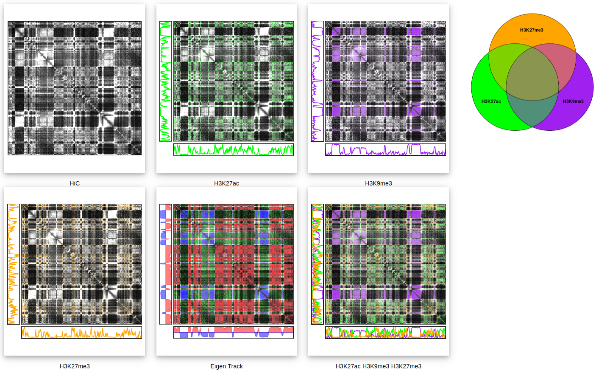

  

------------------------------------------
# About

Welcome to HiCrayon! 

HiCrayon is a tool used to visualize the complex layering of chromatin organization across Hi-C, Micro-C, ChIP-seq, and CUT&RUN in a single image!

Use HiCrayon to create beautiful images and visualize 1D tracks on 2D matrices.

  

------------------------------------------

 

# Quick Links

[Installation](../../wiki/Installation) 

[Usage](../../wiki/Detailed-Usage) 

# Quick Start

## Install 

Build a singularity container from a docker image.

1. `singularity build hicrayon.sif docker://nolandocker/hicrayon:v2`

Clone the hicrayon git repository.

2. `git clone https://github.com/JRowleyLab/HiCrayon.git`

## Run

`cd` into the HiCrayon directory and run the app inside the container

3. `singularity exec hicrayon_container.sif Rscript run.R`

## Visualize the example

Under the sidebar option, **Hi-C**, at the bottom you'll see a button called 'Example Setup'. Click this and the application will automatically populate with the following data:

  * **Hi-C** from a human colon cancer cell line.
  * **Three histone marks** uploaded in bigwigs; H3K9me3, H3K27me3 and H3K27ac
  * **Eigenvector** uploaded as a bedgraph.

All you need to do now is click 'Generate' at the bottom of the sidebar, and it will load in all the above data, do some HiCrayon stuff, and output the Hi-C map, but now it's colored by histone occupancy, and the eigenvector status! 

### Try your own! 

Upload a Hi-C file from a local directory, or by importing through a URL and start visualizing! Detailed instructions on usage can be found here: [Usage](../../wiki/Detailed-Usage) 

---------------------------------------------
# Web version

A *lite* version of HiCrayon is available at:

  <a href="https://jrowleylab.com/HiCrayon/" style="font-weight: bold;">jrowleylab.com/HiCrayon/</a>

  

**This version supports ONLY small file uploads.**
Small Hi-C maps or 1D tracks can be uploaded, but we have implemented a size cap. However, published Hi-C maps and bigwigs from ENCODE (https://www.encodeproject.org/) are able to be visualized in their entirety.
<!-- and locally stored small bedGraph files. -->

To fully avail yourself of the utility of HiCrayon, please [Install](../../wiki/Installation) a local version of the app.

---------------------------------------------
# Requirements for Installation
To install HiCrayon, we use containerized Singularity that allows for a portable, reproducible environment.  
* [Singularity](https://github.com/JRowleyLab/HiCrayon/wiki/installation) is our primary method has excellent [installation](https://docs.sylabs.io/guides/3.0/user-guide/installation.html) documentation.
* [Conda] is also available but **NOT** recommended.

At least 10 gigabytes of storage are recommended for the installation of the application, singularity image, and storage of the large experiment files.

---------------------------------------------
# Contacts
HiCrayon is available for public use and accompanies the publication https://doi.org/10.1101/2024.02.11.579821.

Please address questions to the primary author: bnolan@unmc.edu

