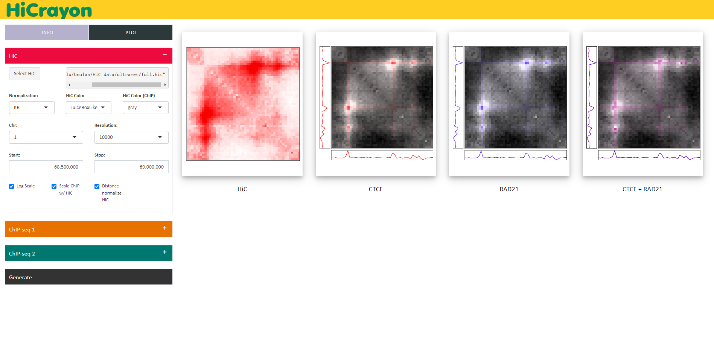
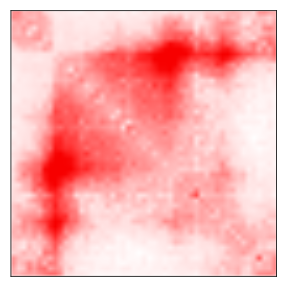
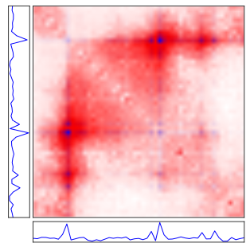
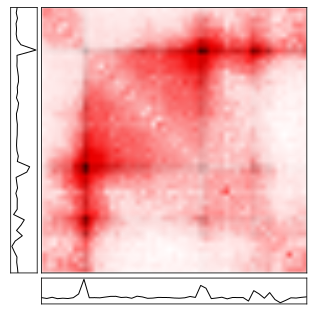
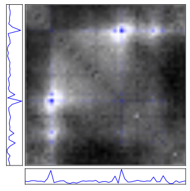
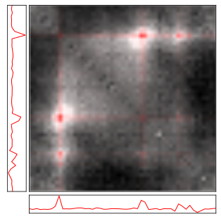
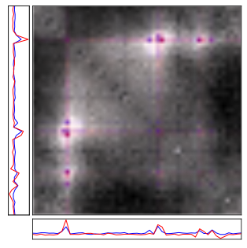

## Co-visualisation of Hi-C and ChIP-seq data

---------------------------------------------

# Quick-start

### **Docker**

**NOTE:** Not yet available, docker repo is private

1. Pull the docker image:

`docker pull nolandocker/hicrayon`

2. Run a hicrayon container, attaching your data directory:

`docker run --rm -p 3838:3838 -v <data_dir>:<name_in_container> nolandocker/hicrayon`

3. Access HiCrayon on any web browser:

`0.0.0.0:3838`

### **Singularity**

Sometimes you don't have the admin access that docker requires. Singularity works instead, although you need to clone the repo too

Build singularity image from docker image

1. `singularity build hicrayon.sif docker://nolandocker/hicrayon`

Clone the hicrayon git repo

2. `git clone https://github.com/JRowleyLab/HiCrayon.git`

`cd` into the HiCrayon directory and run the app inside the container

3. `singularity exec ~/Containers/hicrayon.sif R -e "shiny::runApp('app.R', launch.browser=F, port = 3838)" ` 

### **Conda**

1. Create a conda environment with the hicrayon yaml file

`conda create -n hicrayon hicrayon.yml`

2. `conda activate hicrayon`

Clone the hicrayon git repo and `cd` into the repo

3. `git clone https://github.com/JRowleyLab/HiCrayon.git`

Run HiCrayon

4. `R -e 'shiny::runApp("app.R", launch.browser=F)'`

-----------------------------------------------------------------

# What to expect!

### Generate a HiC image with overlay ChIP-seq tracks on top!

HiC                       |  CTCF                    |  RAD21        
:-------------------------:|:-------------------------:|:-------------------------:
  |   |  

### Let's see how both proteins co-localize on our HiC map (Change HiC color to greyscale to help viewing)

CTCF                       |  RAD21                    |  Combined        
:-------------------------:|:-------------------------:|:-------------------------:
  |   |  

