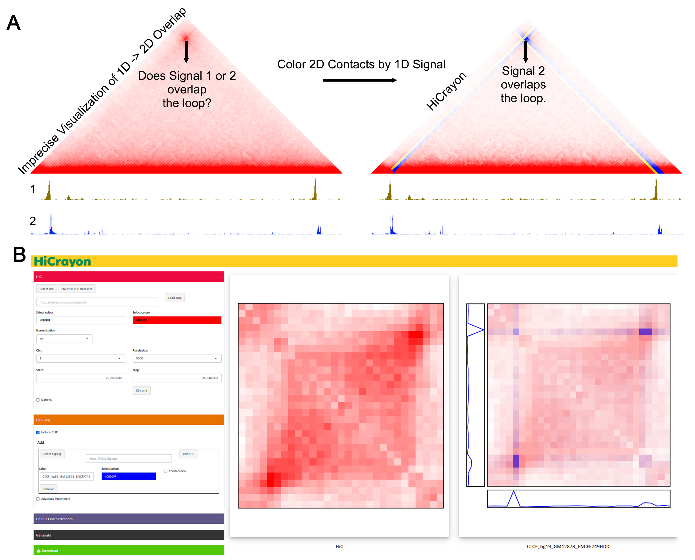
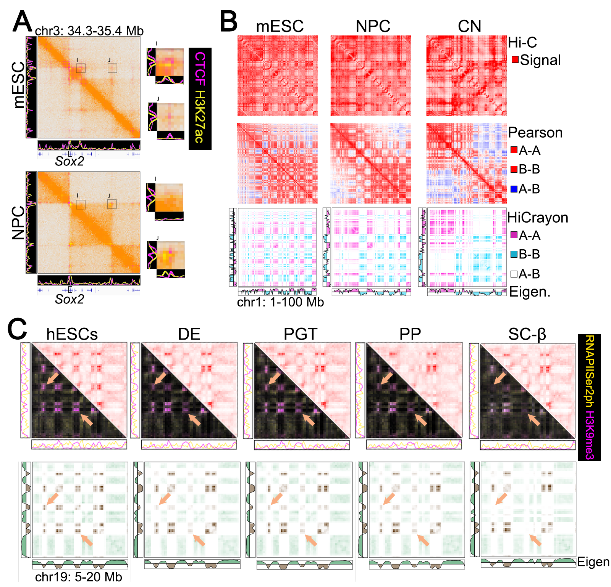
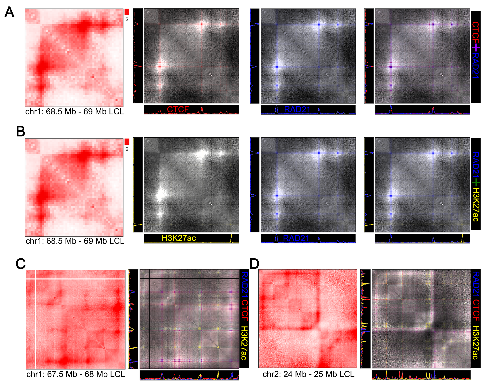

------------------------------------------

## Co-visualisation of Hi-C with signal track data

Visualize Hi-C with any bigwig or bedGraph to combine both forms of data in a single image.

### Bigwig
- Values > 0 (ChIP-seq, RNA-seq, etc.) 
- chr | start | stop | value

### bedGraph
- Values below and above 0 (Hi-C Compartment calls)
- chr | start | stop | value

---------------------------------------------

# Web version

A light version of HiCrayon that allows import of publically availble Hi-C maps, bigwigs through URL eg. from ENCODE (https://www.encodeproject.org/), and locally stored small bedGraph files.

https://jrowleylab.com/HiCrayon/

To fully avail of the utility of HiCrayon, please proceed with installation below

# Quick-start

## **Singularity**

Singularity allows deployment of HiCrayon using a container so you don't need to worry about software compatibility issues.

#### Build singularity image from docker image

Build a singularity container from a docker image.

1. `singularity build hicrayon.sif docker://nolandocker/hicrayon`

Clone the hicrayon git repository.

2. `git clone https://github.com/JRowleyLab/HiCrayon.git`

`cd` into the HiCrayon directory and run the app inside the container

3. `singularity exec ~/Containers/hicrayon.sif R -e "shiny::runApp('app.R', launch.browser=F, port = 3838)" `

Additional parameters:
- if you'd like to attach a directory outside of your own: `-B /:/filesystem/`
- host application to allow access on another device (beware security risks): `shiny::runApp(..., host="IPADDRESS")`

### **Conda** (Not recommended)

1. Create a conda environment with the hicrayon yaml file

`conda create -n hicrayon hicrayon.yml`

2. `conda activate hicrayon`

Clone the hicrayon git repo and `cd` into the repo

3. `git clone https://github.com/JRowleyLab/HiCrayon.git`

Run HiCrayon

4. `R -e 'shiny::runApp("app.R", launch.browser=F)'`

-----------------------------------------------------------------

## Examples

### Accurately visualize protein binding in Hi-C Maps

 

### Reveal distinct layers of multi-state 3D chromatin organization.

 

### Accurately demonstrate chromatin changes in differentiation

### Visualize chromatin loops

