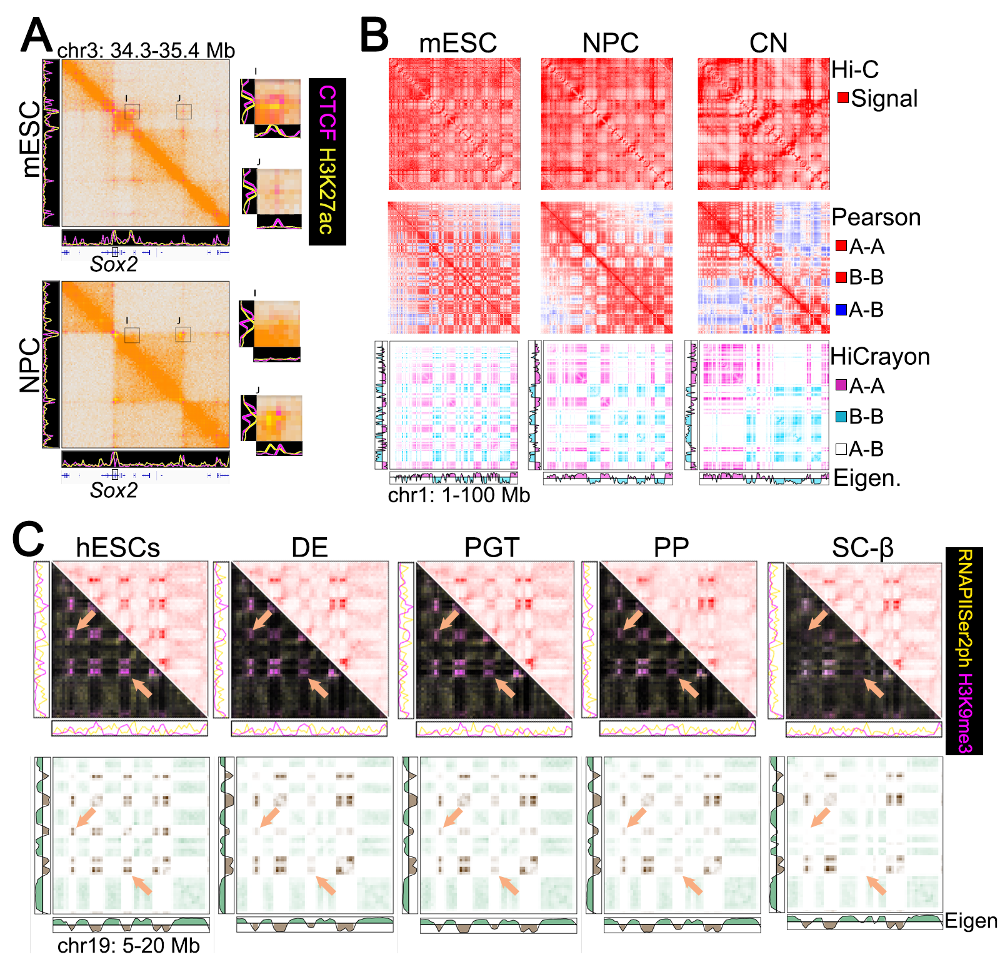
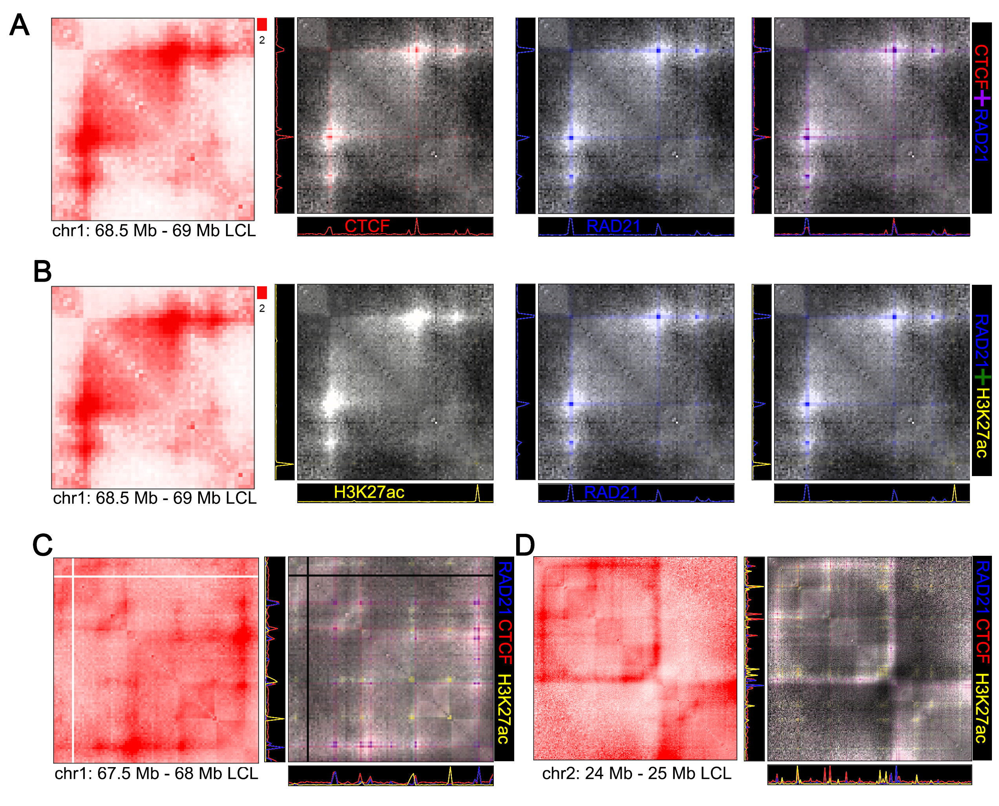

-----------------------------------------------------------------
## Examples

### Accurately visualize protein binding in Hi-C Maps

 

### Reveal distinct layers of multi-state 3D chromatin organization.

 

### Accurately demonstrate chromatin changes in differentiation

### Visualize chromatin loops

