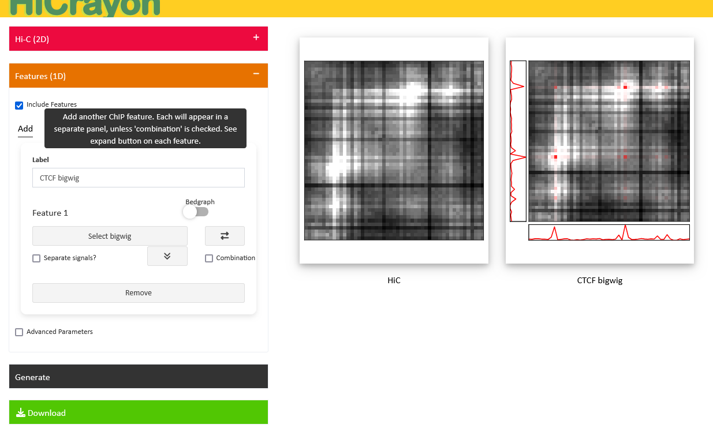
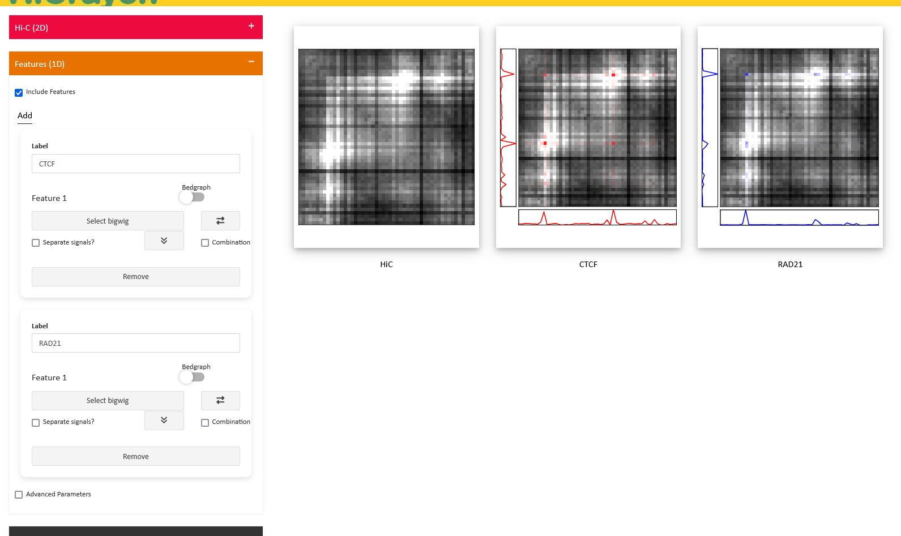

-----------------------------------------------------------------
# Usage Guide

Congratulations! You should now have the functioning HiCrayon app on your local device.

**Note:** HiCrayon is meant as a means of determining which 1D features truly overlap 2D features and for creating final figures. **HiCrayon is not a Genome Browser but is rather meant as a companion tool to existing 2D browsers**, e.g. [Juicebox](https://www.aidenlab.org/juicebox/). We recommend that you browse to identify loci of interest using Juicebox and then use HiCrayon to make final plots. 

In this document, you'll find step-by-step instructions on how to use HiCrayon. From loading up a Hi-C file to adding a bunch of different features and visualizing all simultaneously, and finally downloading all the produced images.

To open HiCrayon, follow the instructions in the [Installation](/www/md_pages/installation.md) page. You can then open up a local verision of the app in your web browser.

## Landing page

You will be greeted by three sections.

**Hi-C (2D):** Loads the Hi-C 2-dimensional 'canvas' that we want to visualize.

**Features (1D):** Loads the traditionally 1-dimensional data (e.g. bigwig, bedgraph) that will 'color' the Hi-C canvas.

**Generate:** Once you have setup the 2D and 1D tracks, click this button to generate the figures.

  

-------------------------------------

## Hi-C

On the sidebar, click on the '+' to open the options. There are a few ways you can get a Hi-C file into HiCrayon. 

1) **Select HiC**: Local File Upload. 

  
  

2) **Load URL**: Paste in a Hi-C URL and click the load URL button. Details on where to get a link are below.

3) **ENCODE**: Choose a Hi-C file from a database of ENCODE-hosted files. This loads in a Hi-C *via* URL.

  

To begin, we will load a publicly available map from the ENCODE dataset. Either choose the ENCODE button to choose between over a hundred Hi-C maps, over enter the URL of the `.hic` file, like so:

`https://www.encodeproject.org/files/ENCFF573OPJ/@@download/ENCFF573OPJ.hic` 

To obtain a link to a file from ENCODE, right-click and copy the link from the download button on the experiment page.

  

Users can also specify a local Hi-C file using the 'Select HiC' button, navigating to the desired .hic file, selecting the file and pressing the 'Select' button in the lower right corner. 

Hi-C matrices contain a vast amount of information on pairwise interactions between genomic regions. **Note** that in lite mode (used for demonstration purposes), we limit the size of the matrix. For high-resolution analysis, we recommend installing the local version which has the full functionality. 

### Advanced Options

Click the 'Options' box at the bottom of the page for more options.

1. `Scale ChIP w/ Hi-C`. Default: True. Weight 1D feature score by Hi-C interaction score. 

2. `Distance Normalization`. Checking this box will apply a `observed/expected+1` normalization to the Hi-C map.

  
  

3. `HiC Threshold`: Choose the maximum value for the Hi-C interaction score. This will represent the upper limit of color range. 
**Recommended Thresholds**:

*Distance-Normalized*: 2

*Raw*: Varies based on sequencing depth. Values are comparable between Juicebox and HiCrayon.

-------------------------------------

## Features 

Now we need to choose some features to color the Hi-C map by. You can choose any bigwig, bedgraph or bed file you'd like to visualize. These datatypes are typical outputs for genomic methods such as, **ChIP-seq**, **CUT&RUN**, **RNA-seq**, **ATAC-seq**. 

Here's an example of some of the things you can do:

  * Color multiple features on a single Hi-C image.
  * Color Hi-C eigenvector with A compartment, B compartment and A-B compartment interactions. 
  * Color interactions between two distinct chromatin features, such as H3K27ac and H3K9me3 interactions.

We'll go into more detail on each of these features down below.

### Add a feature

Click Add to add an extra panel:

  
  

Now you can upload a 1D feature file (Bigwig, bedgraph, bed) and choose some options before you integrate with the Hi-C map.

### Bigwig

Extension: `.bw, .bigwig` 
 A standard output format for many genomic methods. The process of uploading a local file is the same as what you did for the Hi-C above. You can also use a URL if you'd like. 

### Bedgraph

Extension: `.bedgraph` 
 HiCrayon can take a bedgraph and plot it just the same as the bigwig. 
 **Required:** Must contain sorted, non-overlapping regions.

**Eigenvector:** A common datatype generated from Hi-C maps is an eigenvector, which is a bedgraph that contains both positive and negative values that represent active and inactive chromatin states. When you upload a bedgraph, if there are positive and negative values, it will automatically engage an 'Eigen' switch that plots both A and B compartments together, along with interactions between A and B! Also, the UI will update to allow the user to choose colors for all 3 states (A-A, B-B, A-B)

### Bed

Extension: `.bed` 
 HiCrayon can take a bed and plot it by assuming a maximum value for all regions in the file. 
 **Required:** Must contain sorted, non-overlapping regions.

### Generate!
After you've selected the file, click `Generate` and the bigwig will run with the default options. For example, let's load a CTCF bigwig track, based on a local file we have. We can see in the below image, that the increased interactions overlap perfectly with our CTCF ChIP-seq data! 

  

### Feature Options

To open up the 'Options' section, click the highlighted dropdown button. This will reveal a few buttons that allow you to tweak your HiCrayon image.

  
  

**Track Background**
Choose the color of the background of the track on the X and Y-axes.

**Track Line**
Choose the color of your feature. This option not only changes the color of the line on the X and Y-axes but also the color of the feature on the Hi-C itself. 

Change the width of the track line with the slider!

**Data Range**
Choose a minimum and maximum value for your feature. This acts as the floor and ceiling to which all data values will be normalized. This is analogous to 'Data Range' in the tool Integrative Genomics Viewer (IGV). Automatically updates when the data is generated the first time and will reset to empty if the locus is changed.

**Log**
A box that allows the logarithmic transformation of the data. Consider if the data has large variances in peaks and background. 

**NOTE:** HiCrayon works by calculating transparency as a function of the 1D signal (weighted by Hi-C too, usually). If you'd like to reduce variance in your data, and thus minimize the discrepancy between transparency across peaks, consider altering the `Data Range` or `Log` transforming your data.

### Advanced Parameters

**Feature Alpha**: Adjust the total transparency of the 1D feature.

**Hi-C Alpha**: Adjust the total transparency of the Hi-C matrix.

`0:` 100% Transparent
`1:` 0% Transparent

### Color Recommendation

Consider selecting a Hi-C matrix color in the following manner:

`Low:` Black
`High:` White

This utilizes a white background for high signal, making the color much more visible.

  

### Multiple Features

Add multiple panels, and visualize many features simultaneously! This can be done separately or in the same image. 

For example, we add a second panel and upload a bigwig file for RAD21, a protein part of the cohesin complex. Cohesin and CTCF are known to create increased interactions seen in a Hi-C map. The signals look like they overlap quite a bit!

  
  

**Combination** Lets plot both CTCF and RAD21 on the *same* image. To do this, check the `combination` button. All panels where this button is checked, will be combined in a single image. 
 

Any bins where there are signals from multiple features will find a color that represents all, based on the signal from each. Think of this like adding in paint from multiple cans. In this example, if CTCF had 2x the signal (relative to itself) compared to RAD21, then the color split between blue and red would be 2xRED and 1xBLUE. The actual color from this calculation is found from the RGB color space. We try to help you here by adding a Eulerr diagram showing all color combinations from your chosen features.

  
    

You can do this for about as many features as you want. But be careful that if the signals overlap the same bin, the results can get unclear pretty quickly.

### Separate Signals

This feature allows you to visualize interactions between two chromatin loci, that have distinct chromatin features on each side! An example of this would be interactions where one side you have H3K27me3, and on the other you have H3K27ac. Now, any hightlighted interactions are that between those two histone marks. 

  

 

Here, on the panel with CTCF, we select the `Separate Signal` option. This changes the UI, and now we have a section to upload another bigwig. The `Options` dropdown for the first bigwig contains options for track and background color, and the Data Range options. The dropdown for signal 2 will only contain the Data Range, as the options for signal 1 will apply to signal 2 too.

### Download

Click the `Download` button to download all images you can see on your screen to the device that HiCrayon is open on. Once clicked, a zip folder will download that contains a **png** and **svg** for each image. The names will contain some metadata to make life easier, such as:

* Type (HiC, ChIP)
* Chromosome - Start - Stop - Binsize
* Hi-C normalization method (KR, VCSQRT)

[Return to Main Page](/README.md)
